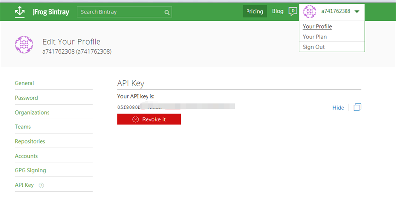
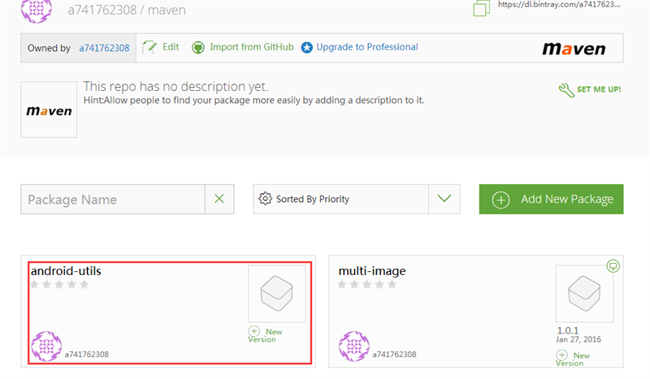
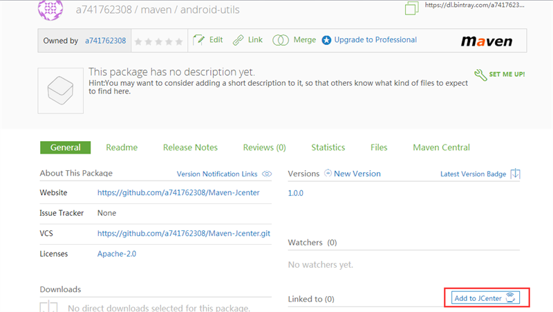
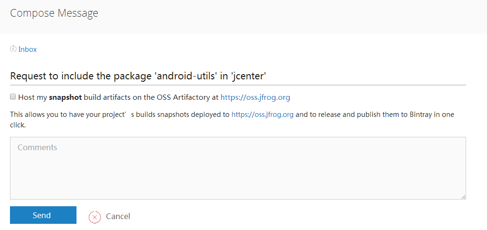

:running: 使用Gradle发布aar项目到JCenter仓库:running:
#注册账号
在 https://bintray.com/ 上注册一个账号,可以使用github账号注册（打不开的请自行翻墙）
登录成功后进去用户中心获取apikey，见下图

#配置
##local.properties
在该文件尾中输入
```java
 bintray.user=bintray的账号
 bintray.apikey=你的apikey
```
##build.gradle
###Project 
在dependencies在加入
```java
 classpath "com.jfrog.bintray.gradle:gradle-bintray-plugin:1.5"
 classpath 'com.github.dcendents:android-maven-gradle-plugin:1.3'
```
详情请点[这里](build.gradle)
###你的Module中
```java
 apply plugin: 'com.github.dcendents.android-maven'
 apply plugin: 'com.jfrog.bintray'
```
```java
def siteUrl = ''      // 项目的主页
def gitUrl = ''   // Git仓库的url
group = "" // Maven Group ID for the artifact，一般填你唯一的包名
install {
    repositories.mavenInstaller {
        // This generates POM.xml with proper parameters
        pom {
            project {
                packaging 'aar'
                // Add your description here
                name ''  //项目描述
                url siteUrl
                // Set your license
                licenses {
                    license {
                        name 'The Apache Software License, Version 2.0'
                        url 'http://www.apache.org/licenses/LICENSE-2.0.txt'
                    }
                }
                developers {
                    developer {
                        id ''       //填写开发者基本信息
                        name ''
                        email ''
                    }
                }
                scm {
                    connection gitUrl
                    developerConnection gitUrl
                    url siteUrl
                }
            }
        }
    }
}
task sourcesJar(type: Jar) {
    from android.sourceSets.main.java.srcDirs
    classifier = 'sources'
}
task javadoc(type: Javadoc) {
    source = android.sourceSets.main.java.srcDirs
    classpath += project.files(android.getBootClasspath().join(File.pathSeparator))
}
task javadocJar(type: Jar, dependsOn: javadoc) {
    classifier = 'javadoc'
    from javadoc.destinationDir
}
artifacts {
    archives javadocJar
    archives sourcesJar
}
Properties properties = new Properties()
properties.load(project.rootProject.file('local.properties').newDataInputStream())
bintray {
    user = properties.getProperty("bintray.user")
    key = properties.getProperty("bintray.apikey")
    configurations = ['archives']
    pkg {
        repo = "maven"  //发布到Bintray的那个仓库里，默认账户有四个库，我们这里上传到maven库
        name = ""  //发布到Bintray上的项目名字
        websiteUrl = siteUrl
        vcsUrl = gitUrl
        licenses = ["Apache-2.0"]
        publish = true
    }
}
```
#上传
##gradle build
在项目的根目录下执行gradle命令
```java
 gradle build
```
不识别的请点[这里](http://jingyan.baidu.com/article/cbcede072a958202f40b4d97.html?st=2&os=0&bd_page_type=1&net_type=1)配置环境变量
这里会出现比较坑的情况,可以参考[Android 项目打包到 JCenter 的坑](http://www.jcodecraeer.com/a/anzhuokaifa/Android_Studio/2015/0515/2873.html)

- 编码GBK不可映射字符
这个问题困扰了好久，主要是我们使用了中文注释
我尝试改过工作目录的字符集，添加
tasks.withType(JavaCompile) {
    options.encoding = 'UTF-8'
}
修改android studio的字符集等都不能得到解决，其实解决方式很简单
只需要将javadoc修改一下就好了
```java
task javadoc(type: Javadoc) {
    options.encoding = "UTF-8"//添加这句
    source = android.sourceSets.main.java.srcDirs
    classpath += project.files(android.getBootClasspath().join(File.pathSeparator))
}
```
- 类找不到异常
可以添加如下代码
```java
android.libraryVariants.all { variant ->
    println variant.javaCompile.classpath.files
    if(variant.name == 'release') { //我们只需 release 的 javadoc
        task("generate${variant.name.capitalize()}Javadoc", type: Javadoc) {
            // title = ''
            // description = ''
            source = variant.javaCompile.source
            classpath = files(variant.javaCompile.classpath.files, project.android.getBootClasspath())
            options {
                encoding "utf-8"
                links "http://docs.oracle.com/javase/7/docs/api/"
                linksOffline "http://d.android.com/reference", "${android.sdkDirectory}/docs/reference"
            }
            exclude '**/BuildConfig.java'
            exclude '**/R.java'
        }
        task("javadoc${variant.name.capitalize()}Jar", type: Jar, dependsOn: "generate${variant.name.capitalize()}Javadoc") {
            classifier = 'javadoc'
            from tasks.getByName("generate${variant.name.capitalize()}Javadoc").destinationDir
        }
        artifacts {
            archives tasks.getByName("javadoc${variant.name.capitalize()}Jar")
        }
    }
}
```

完整的这里参考[这里](utils/build.gradle)
##gradle bintrayUpload
当gradle build出现SUCCESS时,我们执行如下命令
```java
 gradle bintrayUpload
```
上传成功后，就会在bintray的maven仓库下看到我们上传的Library

#提交项目到Jcenter

我们点开我们刚刚提交项目的主页

点击右下角的add to jcenter按钮

填写Comments 点击Send等待审核
大约1小时左右审核便会通过，就可以在build.gradle 中使用我们的库了
```java
dependencies {
    compile fileTree(include: ['*.jar'], dir: 'libs')
    testCompile 'junit:junit:4.12'
    compile 'com.android.support:appcompat-v7:23.1.1'
//    compile project(':utils')
    compile 'com.jsqix.utils:utils:1.0.0'
}
```java
#感谢
[Android Studio发布项目到Jcenter](http://blog.saymagic.cn/2015/02/16/release-library-to-jcenter.html)
[Android 项目打包到 JCenter 的坑](http://www.jcodecraeer.com/a/anzhuokaifa/Android_Studio/2015/0515/2873.html)

#License

    Copyright 2015 a741762308

    Licensed under the Apache License, Version 2.0 (the "License");
    you may not use this file except in compliance with the License.
    You may obtain a copy of the License at

       http://www.apache.org/licenses/LICENSE-2.0

    Unless required by applicable law or agreed to in writing, software
    distributed under the License is distributed on an "AS IS" BASIS,
    WITHOUT WARRANTIES OR CONDITIONS OF ANY KIND, either express or implied.
    See the License for the specific language governing permissions and
    limitations under the License.


